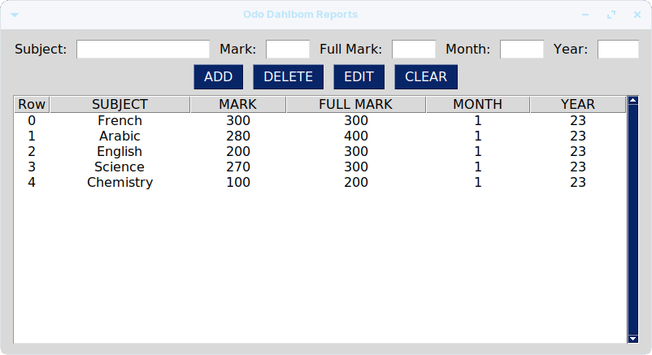

# school-mangment
Manage students, fees, report cards and more.


## Students
<hr/>





## Print Reports
<hr/>


## Fees
<hr/>


## Settings
<hr/>


To execute, run the 'sg.py' file. (Make sure you have PySimpleGUI installed as well)

```console
pip install PySimpleGUI
python3 ./sg.py
```
